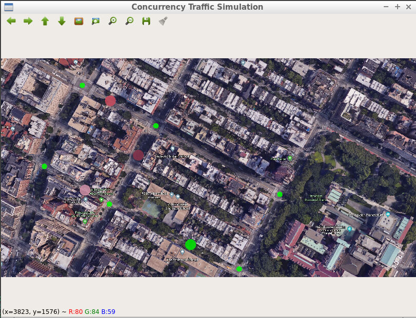

# L1_Project
Description: 

Simulate traffic in a city grid with vehicles, streets and intersections. Vehicles drive around randomly and change direction at each intersection. Each object in the city grid will run independently in its own thread.

Project Tasks
- Task L1.1 : In the base class TrafficObject, set up a thread barrier in its destructor that ensures that all the thread objects in the member vector _threads are joined.

- Task L1.2 : In the Vehicle class, start a thread with the member function drive and the object this as the launch parameters. Also, add the created thread into the _thread vector of the parent class.

- Task L1.3 : Vary the number of simulated vehicles in main and use the top function on the terminal or the task manager of your system to observe the number of threads used by the simulation.

Dependencies:
-   OpenCV 

How to run this project:

    root@a9ad274128c4:/home/workspace/L1_Project# mkdir build
    root@a9ad274128c4:/home/workspace/L1_Project# cd build
    root@a9ad274128c4:/home/workspace/L1_Project/build# cmake ..
    root@a9ad274128c4:/home/workspace/L1_Project/build# make
    root@a9ad274128c4:/home/workspace/L1_Project/build# ./traffic_simulation